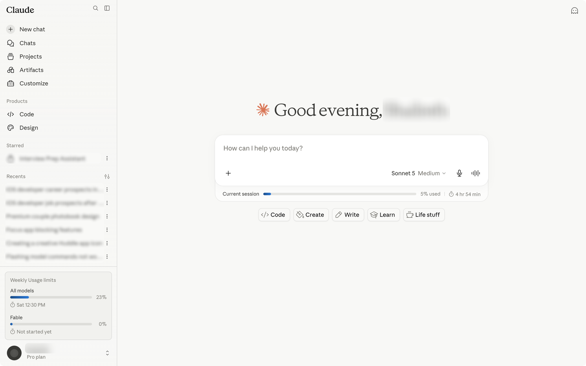
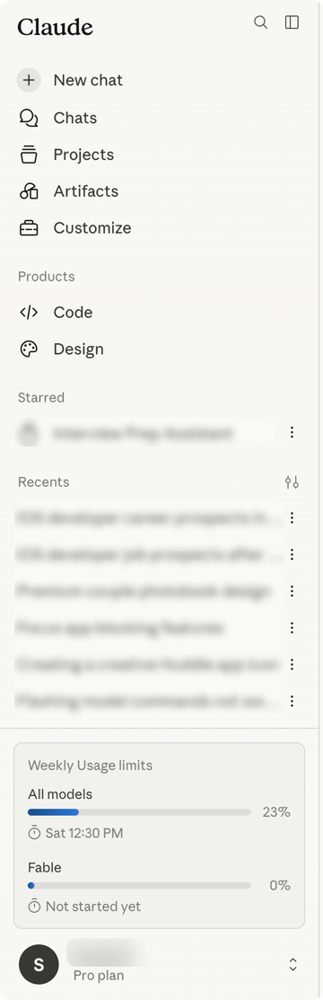
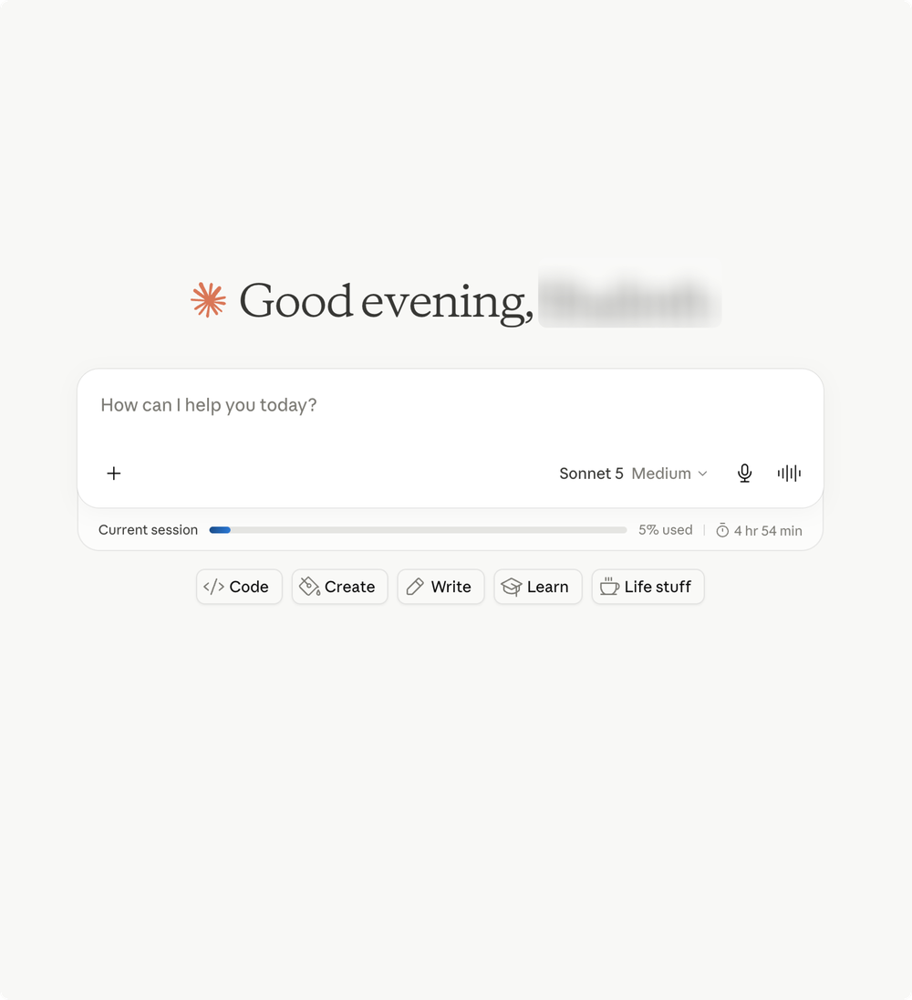
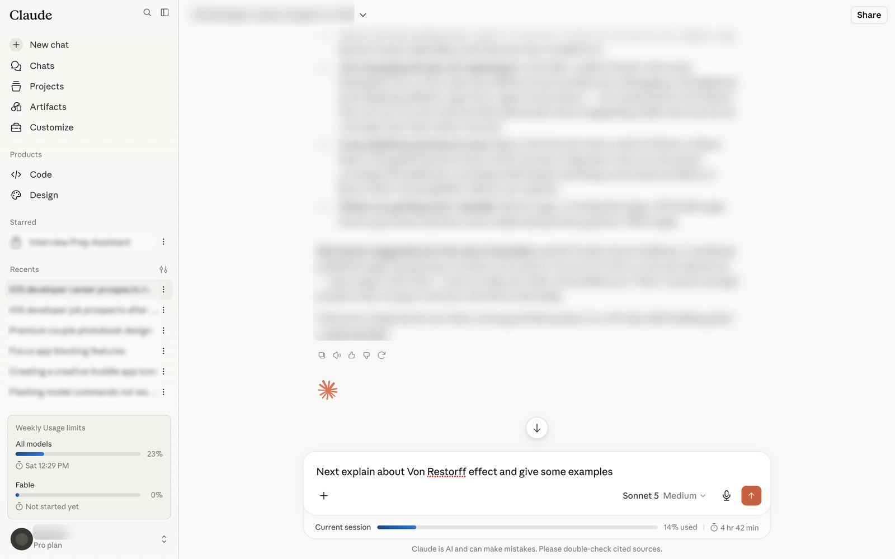

# Claude Usage Stats

A browser extension that surfaces your Claude usage right on **claude.ai**, so you don't have to dig into Settings.

It shows:
- a **Usage limits** card in the sidebar (weekly limits on Pro/Max/Team),
- a **session / spend** strip under the chat composer,
- a **Claude Design** meter on Design pages.

Works for **Pro, Max, Team, and Enterprise** (spend-based) plans, adapts to light/dark theme, and reads your real numbers from **Settings → Usage** automatically in the background.

Chromium browsers only (Chrome, Edge, Brave, Arc, Opera) — Manifest V3.

## Screenshots

**Sidebar usage card** — weekly limits, pinned above your profile:

**Composer strip** — current session (or spend) tucked under the composer:

**In use** — it stays put while you chat:

## Install (Load unpacked)

1. Download this folder (clone or unzip) somewhere permanent.
2. Open `chrome://extensions` (or `arc://extensions`, `edge://extensions`, …).
3. Turn on **Developer mode** (top-right).
4. Click **Load unpacked** and select this folder (the one with `manifest.json`).
5. Open **https://claude.ai** — your stats appear a second or two later and refresh while the tab is open.

After editing any file, return to the extensions page and click **reload ↻** on the card, then reload the claude.ai tab.

## Notes

- Reads Claude's undocumented in-page DOM, so a claude.ai redesign may need selector tweaks (`content.js`) or parser tweaks (`usage-provider.js`).
- To preview the UI without a live session, set `USE_MOCK = true` in `usage-provider.js`.
- Unofficial tool, not affiliated with Anthropic.
